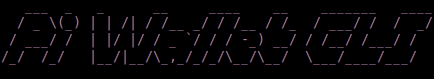

# Pi Wallet CLI

[](https://github.com/limitpointinf0/pi-wallet-cli/blob/main/LICENSE)

## Getting Started: A Simple Walkthrough

1. Setup the pi-wallet command globally
```bash
git clone https://github.com/limitpointinf0/pi-wallet-cli
cd pi-wallet-cli
npm i -g
```

2. Set your default account. You may unset it or set a different one later.
```bash
pi-wallet set
```
This will ask you for your account address which is your public key.

3. After you've set your default account, you can check your balances for all assets with the following
```bash
pi-wallet check
```

4. Making a transfer is simple. Just run the following and follow directions
```bash
pi-wallet transfer
```
- Source Account Passphrase/PrivateKey: [Your wallet passphrase or private key] 
- Destination Account: [Wallet address of the account you want to send to]
- Asset: [Name of asset you want to send. Leave blank if you want to just send Pi]
- Asset Issuer: [Address for the asset issuer account. Leave blank for Pi]
- Transfer Amt: [Amount of the asset you want to send]
- Memo: [An optional memo for this transaction]

After setting the above, the transaction will be signed and sent and you should receive the results shortly.

## Extra Features

### Creating Trustlines
If you would like to allow your account to send and recieve custom assets, you will first need to setup a trustline which requires both the asset name and asset issuer account address.
```bash
pi-wallet trust
```
If the trustline setup succeeds, you can check your account balance and see the new asset is added with a balance of 0
```bash
pi-wallet check
```

### Purchasing/Selling an Asset
Purchasing/Selling an asset may be done using the following
```bash
pi-wallet purchase
```
or
```bash
pi-wallet sell
```

- Source Account Passphrase/PrivateKey: [Your wallet passphrase or private key] 
- Asset Name to Buy/Sell: [Name of the asset you want to purchase/sell]
- Amount of Asset to Buy/Sell: [Amount of asset you want to purchase/sell]
- Buying/Selling Asset: [Name of asset you want to trade]
- Price per unit: [Price of asset per unit]
- Issuer Account Address: [Address of issuer account for this asset]


### Creating a Custom Asset
Creating an asset may be done using the following
```bash
pi-wallet createasset
```

- Issuer Account Address: [Issuer public key] 
- Issuer Account Passphrase/Private Key: [Issuer account passphrase or private key]
- Distributor Account Address: [Distributor public key] 
- Distributor Account Passphrase/Private Key: [Distributor account passphrase or private key]
- Asset Name: [Name for your asset]
- Asset Amount: [Amount of asset you want to create]
- Asset Data [name]: [Key for key/value pair, data regarding the asset]
- Asset Data [value]: [Value for key/value pair, data regarding the asset]